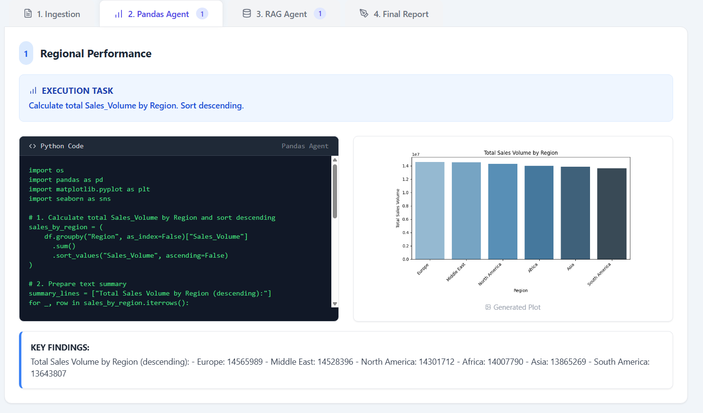
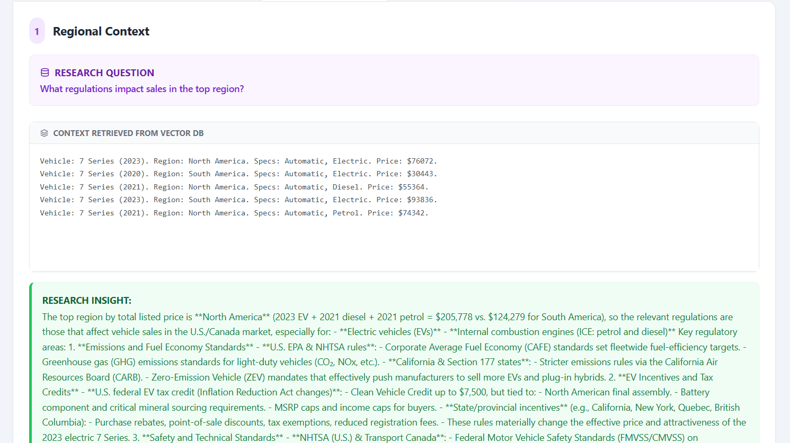
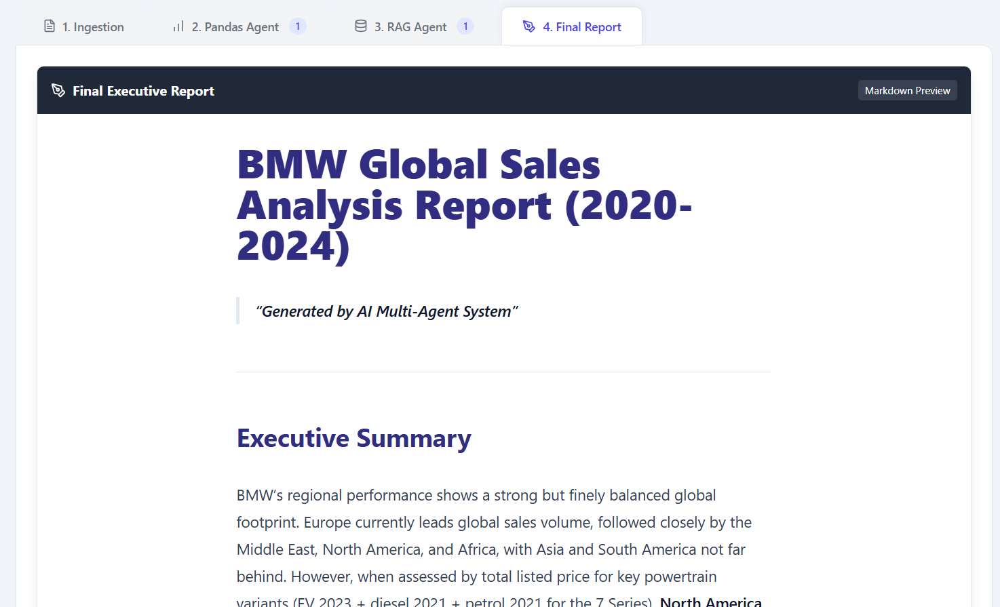

# 🤖 Automated LLM Report Generation & Insight Engine

## 📖 Overview

This project is an AI-powered analytics platform designed to automate business reporting from structured data. It utilizes a **Multi-Agent Architecture** to synthesize quantitative analysis (via Pandas) and qualitative insights (via RAG/Vector Search) into cohesive executive reports.

The system was built as a prototype to analyze BMW Global Sales Data (2020-2024), demonstrating how LLMs can orchestrate complex analytical tasks, generate visualizations, and produce narrative storytelling without human intervention.

---

## 🚀 Key Features
Here is a quick look at the main feature:


### 1. Data Ingestion & Configuration
Upload datasets and automatically detect schema configurations. The system identifies column types and prepares the data for agentic workflows.


### 2. Pandas Agent (Quantitative Analysis)
The Pandas Agent generates Python code on the fly to answer user queries. It executes the code to produce statistical summaries and visualizations (e.g., bar charts, trend lines) based on the ingested data.



### 3. RAG Agent (Qualitative Research)
The Retrieval-Augmented Generation (RAG) Agent queries a vector database to provide contextual answers to research questions. It combines retrieved context with LLM capabilities to generate comprehensive insights, such as regulatory impact analysis.



### 4. Final Executive Report
The system synthesizes the quantitative metrics from the Pandas Agent and the qualitative insights from the RAG Agent into a cohesive final report. This automated Markdown document presents a high-level executive summary, combining data trends with regulatory context to provide actionable business intelligence.


---

## 📂 Project Structure
```
/my-project-folder
├── README.md <-- Project documentation
├── requirement.txt <-- Python dependencies
├── server.py <-- Main application entry point/API server
├── DualAgentProcess.py <-- Core Python logic
├── ImportConfig.py
├── InsightSynthesisEngine.py
├── final_report.md
├── data/ <-- Input data storage
│   └── BMW sales data (2020-2024).xlsx
└── my-app/ <-- Frontend (React/Vite)
    ├── package.json
    ├── .gitignore <-- Includes `node_modules/`
    └── src/
        ├── App.jsx
        └── ... (other frontend files)
```
---
## 🛠️ Architecture

The solution follows a modern client-server architecture:

| Component | Technology | Role |
| :--- | :--- | :--- |
| **Frontend** | React + Tailwind CSS | Visualization & User Input |
| **Backend** | FastAPI | Orchestration Layer |
| **LLM Integration** | OpenAI API | GPT Models |
| **Vector Storage** | ChromaDB | Local persistent storage |
| **Data Processing** | Pandas & Matplotlib | Data Analysis |

---

## 📦 Installation & Setup

### Prerequisites

* Python 3.9+
* Node.js & npm
* OpenAI API Key

### 1. Backend Setup

1.  Clone the repository.
2.  Navigate to the root directory.
3.  Install Python dependencies:
    ```bash
    pip install -r requirements.txt
    ```
4.  Set up your environment variables:
    * Create a `.env` file (or export in terminal) with your API key:
        ```bash
        export OPENAI_API_KEY="your-sk-key-here"
        ```

### 2. Frontend Setup

1.  Navigate to the my-app folder (or wherever your React app resides).
2.  Install dependencies:
    ```bash
    cd my-app
    npm install
    ```

### 3. Running the Application

1.  Start the Backend API:
    ```bash
    python server.py
    ```
2.  Start the development server:
    ```bash
    cd my-app
    npm run dev
    ```
3.  Open your browser to the URL provided by the frontend (usually `http://localhost:5173`).

> **Note on Initial Run:** On the very first run, the system will take a few moments to ingest the Excel data into ChromaDB. Subsequent runs will be instant.