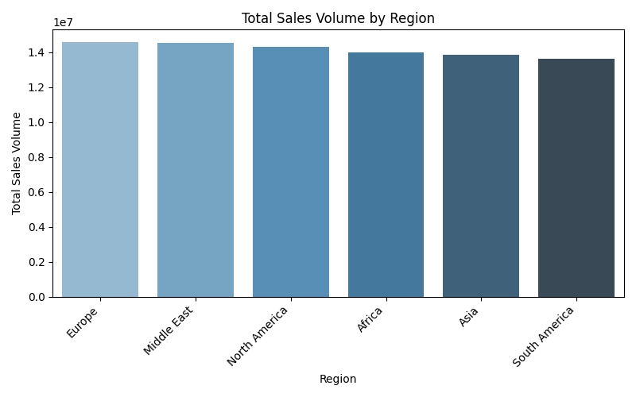

# BMW Global Sales Analysis Report (2020-2024)

> Generated by AI Multi-Agent System

## Executive Summary

BMW’s regional performance shows a strong but finely balanced global footprint. Europe currently leads global sales volume, followed closely by the Middle East, North America, and Africa, with Asia and South America not far behind. However, when assessed by total listed price for key powertrain variants (EV 2023 + diesel 2021 + petrol 2021 for the 7 Series), **North America emerges as the highest‑value region**, outpacing South America by a significant margin ($205,778 vs. $124,279 in the sampled pricing).

This divergence between **volume leadership (Europe, Middle East)** and **value leadership (North America)** has direct strategic implications. In North America, stringent emissions and fuel‑economy standards, evolving EV incentives, and state‑level zero‑emission vehicle (ZEV) mandates are reshaping the economics and product mix for premium vehicles such as the 7 Series. To preserve and grow high‑margin sales in North America, BMW must:

- Align fleet planning with tightening U.S. EPA/NHTSA and CARB/ZEV regulatory trajectories.
- Optimize 7 Series powertrain and sourcing strategies to fully capture U.S. federal EV tax credits and key state/provincial incentives.
- Mitigate regulatory and trade frictions through proactive compliance and regional content planning under USMCA.

The remainder of this report connects BMW’s regional volume performance with the regulatory and market realities in North America, outlining strategic levers to maintain profitability and competitive advantage in the company’s highest‑value region.

---

## 1. Global Regional Performance Overview

### 1.1 Relative Sales Volumes by Region

Total sales volume by region (descending):

- **Europe:** 14,565,989  
- **Middle East:** 14,528,396  
- **North America:** 14,301,712  
- **Africa:** 14,007,790  
- **Asia:** 13,865,269  
- **South America:** 13,643,807  

Key observations:

1. **Narrow dispersion at the top:**  
   - Europe, Middle East, and North America form a tight cluster at the high end of global sales volumes. The deltas between these three regions are relatively modest, indicating broad global diversification rather than dependence on a single geography.

2. **Balanced second tier:**  
   - Africa, Asia, and South America follow closely, with no region dramatically lagging in absolute volume. This suggests that BMW has successfully established a broadly distributed 7 Series presence, with resilience against localized demand shocks.

3. **Volume vs. value asymmetry:**  
   - While Europe leads in unit volume, and Middle East and North America are close behind, **North America delivers the highest combined listed price** for the 7 Series configurations analyzed. This indicates that the North American mix skews toward higher‑priced variants and/or richer specifications.

### 1.2 Strategic Interpretation

From a portfolio standpoint:

- **Europe and the Middle East** are critical for sustaining global scale and production utilization, given their top‑tier volumes.
- **North America**, while only marginally behind in volume, stands out in **revenue and margin potential**, particularly for premium flagship models like the 7 Series.
- **Asia and South America**, despite being in the lower half of the volume ranking, remain important future growth and diversification platforms, but they are not yet as central to the 7 Series’ high‑value positioning as North America.

This pattern justifies **disproportionate strategic focus on North America** for regulatory navigation, pricing optimization, and technology deployment, as discussed in the next section.

---

## 2. North America: High‑Value Region Under Intensifying Regulatory Pressure

### 2.1 North America as the Pricing and Value Leader

Based on the aggregated listed prices for key 7 Series configurations (2023 EV + 2021 diesel + 2021 petrol):

- **North America:** $205,778  
- **South America (for comparison):** $124,279  

Implications:

- **Higher realized revenue potential per vehicle** in North America, given the premium positioning and stronger emphasis on higher‑spec and electrified variants.
- **Greater sensitivity to regulatory‑driven shifts** in powertrain mix and incentives, because a high proportion of value is concentrated in models directly affected by U.S./Canada rules (EVs and ICE premium sedans).

Therefore, while Europe leads in unit sales, **North America is the region where regulatory conditions most strongly shape BMW’s premium revenue and margin trajectory for the 7 Series.**

### 2.2 Regulatory Framework Shaping 7 Series Economics

Regulation in North America can be grouped into five interlocking domains that materially affect BMW’s product, pricing, and profitability decisions.

#### 2.2.1 Emissions and Fuel Economy Standards

- **U.S. EPA & NHTSA (CAFE and GHG standards):**  
  - Fleetwide Corporate Average Fuel Economy (CAFE) and greenhouse gas (GHG) limits require continuous improvements in fuel efficiency and CO₂/NOx reductions.
  - Premium large sedans like the 7 Series, especially high‑output petrol and diesel variants, have **outsized impact** on fleet averages.

- **California & Section 177 states (CARB/ZEV mandates):**  
  - States adopting California standards impose stricter emissions limits and ZEV requirements.
  - ZEV mandates effectively **force an increasing share of EVs and plug‑in hybrids (PHEVs)** in markets that are particularly important for luxury sedans (e.g., California, New York, Massachusetts).

Strategic consequences:

- BMW must balance **high‑margin ICE variants** with **sufficient EV and PHEV volumes** to meet fleet and ZEV obligations.
- The 7 Series EV (and potentially plug‑in hybrid derivatives) becomes a **regulatory compliance tool as well as a profit driver**, particularly in CARB/ZEV markets.

#### 2.2.2 EV Incentives and Tax Credits

- **U.S. Federal Clean Vehicle Credit (Inflation Reduction Act):**
  - Up to **$7,500 per qualifying EV**, subject to:
    - Final assembly in North America.
    - Minimum thresholds for North American battery component and critical mineral sourcing.
    - MSRP caps and buyer income limits.

- **State/provincial incentives (e.g., California, New York, Quebec, British Columbia):**
  - Additional purchase rebates, tax exemptions, or point‑of‑sale discounts.
  - Reduced registration fees and other non‑price benefits.

Impact on the 7 Series:

- The **effective transaction price** for the 2023 electric 7 Series can be meaningfully reduced where vehicles qualify, **enhancing competitiveness vs. rival premium EVs**.
- Conversely, **failure to meet final assembly or sourcing requirements** directly erodes the price‑value equation and may shift high‑value customers to compliant alternatives.

This places **sourcing, manufacturing footprint, and bill‑of‑materials design** at the center of North American 7 Series strategy.

#### 2.2.3 Safety and Technical Standards

- **NHTSA (U.S.) and Transport Canada:**
  - Federal Motor Vehicle Safety Standards (FMVSS/CMVSS) define crashworthiness, occupant protection, lighting, and advanced driver‑assistance requirements.
- **EV‑specific safety rules:**
  - Battery integrity, thermal runaway protections, crash safeguards, and pedestrian warning sounds at low speeds.

These requirements:

- Increase **engineering and homologation complexity** for both EV and ICE variants.
- Offer an opportunity: compliance leadership can be leveraged in marketing (e.g., advanced safety and ADAS features as core attributes of the 7 Series).

#### 2.2.4 Labeling, Testing, and Consumer Information

- **EPA and Natural Resources Canada labeling:**
  - Mandatory fuel economy / energy consumption labels (MPG/MPGe, kWh/100 km, CO₂ metrics).
  - Dynamometer test procedures strongly influence **perceived efficiency** and, by extension, customer comparisons between competing premium EV and ICE sedans.

Implications:

- BMW must carefully **optimize real‑world and test‑cycle performance** to ensure that 7 Series EV and efficient ICE variants are credibly positioned on window labels, a non‑trivial factor in high‑end purchasing decisions.

#### 2.2.5 Trade, Tariffs, and Local Market Measures

- **USMCA rules of origin and regional content:**
  - Requirements for North American content can affect **tariff exposure and profitability**, especially for imported components and high‑value subsystems (e.g., batteries, power electronics).
- **Potential tariffs on vehicles or components from specific countries (e.g., China):**
  - Could alter the **cost base** for EV batteries and electronics if supply chains are not diversified.
- **Local measures (HOV lane access, congestion/low‑emission zones):**
  - Provide incremental **non‑price advantages** for EVs and plug‑in hybrids, particularly in congested metropolitan areas.

For BMW, optimizing 7 Series production, sourcing, and logistics to **qualify under USMCA** and minimize tariff risk is increasingly central to preserving North American margins.

### 2.3 Connecting Regional Performance to Regulatory Strategy

The intersection of the two main findings—balanced global volume and North American value leadership under high regulatory pressure—suggests:

- **Regulatory misalignment in North America would disproportionately affect BMW’s global profitability**, even if global sales volumes remain stable.
- Given the close competition in volume between Europe, Middle East, and North America, **regulatory compliance and incentive optimization in North America can be a decisive differentiator** in overall corporate performance, especially for high‑end models.

BMW’s strategic levers:

1. **Product Mix and Powertrain Strategy**
   - Increase the share and attractiveness of **EV and PHEV 7 Series** in CARB/ZEV states to both capture incentives and ease CAFE/GHG compliance pressure.
   - Retain a **curated ICE portfolio** that emphasizes efficiency and lower emissions without diluting the brand’s performance identity.

2. **Sourcing and Manufacturing Footprint**
   - Prioritize **North American assembly and compliant battery sourcing** for flagship EV 7 Series variants to fully capture federal tax credits.
   - Leverage USMCA‑aligned supply chains to minimize tariff risk and protect margin.

3. **Market and Pricing Strategy**
   - Use the **EV and PHEV variants as price‑elastic, incentive‑leveraged offerings**, enabling BMW to defend or expand share in the premium segment even as nominal sticker prices remain high.
   - Harmonize **window‑label efficiency performance** with real‑world customer expectations to strengthen the 7 Series’ value proposition relative to peers.

4. **Regulatory Foresight and Engagement**
   - Maintain active engagement with U.S. and Canadian regulators to anticipate future thresholds and timelines, particularly around EV credit eligibility and escalating GHG/CAFE targets.
   - Incorporate regulatory trajectories into **mid‑cycle refresh and next‑generation 7 Series planning**, ensuring continuous compliance and competitiveness.

---

## Conclusion and Recommendations

BMW’s current 7 Series performance reflects a **globally balanced volume base**, with Europe, Middle East, and North America forming a narrow top tier. Yet, the **financial centre of gravity** for the 7 Series lies in **North America**, where higher list prices and premium configurations drive superior revenue potential. This same region is characterized by the most complex and fast‑evolving regulatory landscape affecting EVs and ICE vehicles.

To safeguard and enhance profitability in this high‑value region while maintaining global balance, BMW should:

1. **Double‑down on North America‑specific electrification strategy for the 7 Series**  
   - Ensure at least one flagship EV 7 Series variant fully qualifies for the U.S. Clean Vehicle Credit via North American assembly and compliant battery sourcing.  
   - Align product cadence and mix with CARB/ZEV mandates, using EV and PHEV volumes strategically to maintain compliance.

2. **Integrate regulatory compliance into core commercial planning**  
   - Treat EPA/NHTSA and Transport Canada rules, EV tax‑credit eligibility, and USMCA content thresholds as **front‑end business constraints**, not back‑end engineering issues.  
   - Model multiple regulatory scenarios and incorporate them into pricing, mix, and capacity decisions.

3. **Leverage safety, efficiency, and sustainability as premium differentiators**  
   - Highlight leadership in safety (FMVSS/CMVSS compliance plus advanced ADAS), EV battery safety, and credible fuel‑economy/MPGe performance on labels and in marketing.  
   - Use these attributes to justify premium pricing and defend share in a competitive North American luxury segment.

4. **Maintain global diversification while privileging North American value**  
   - Continue nurturing high‑volume regions (Europe, Middle East, and emerging Asian markets) while recognizing that **North American regulatory success is central to overall profit performance** for the 7 Series.  

By systematically linking regional performance analytics to regulatory and incentive structures—particularly in North America—BMW can optimize the 7 Series’ global role: a flagship that not only embodies brand and technological leadership, but also anchors profitability in the world’s most demanding premium automotive market.

### Regional Performance Visualization

