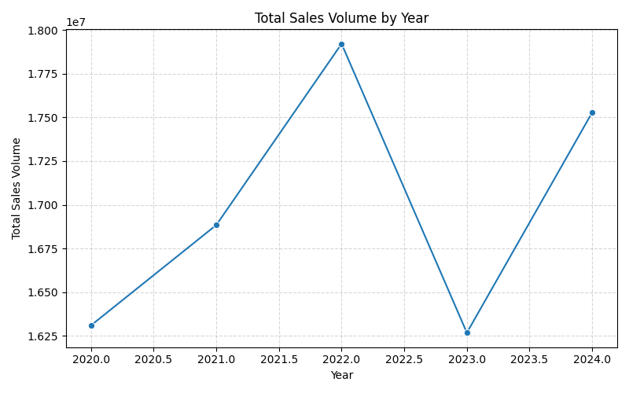
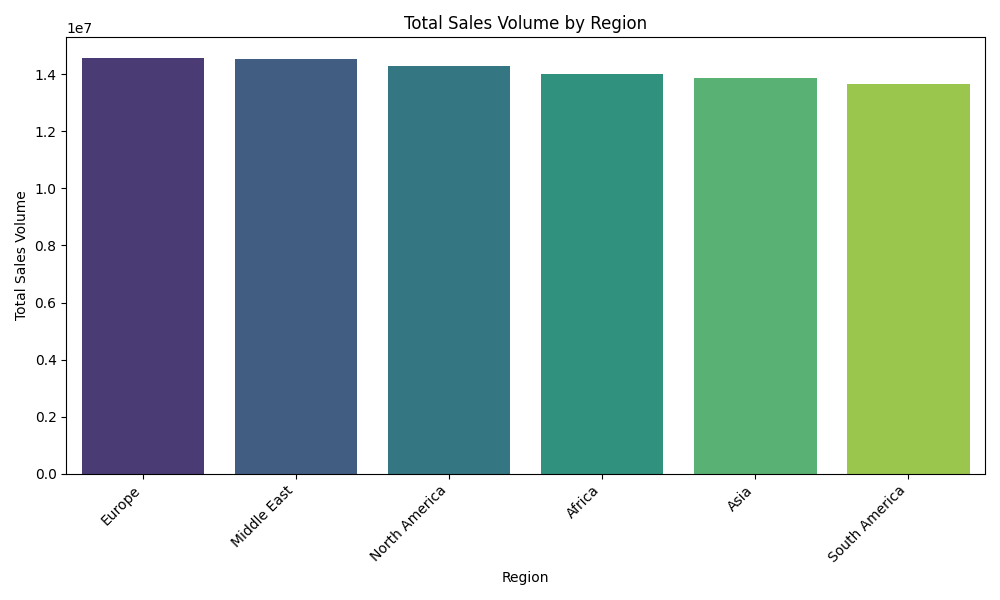
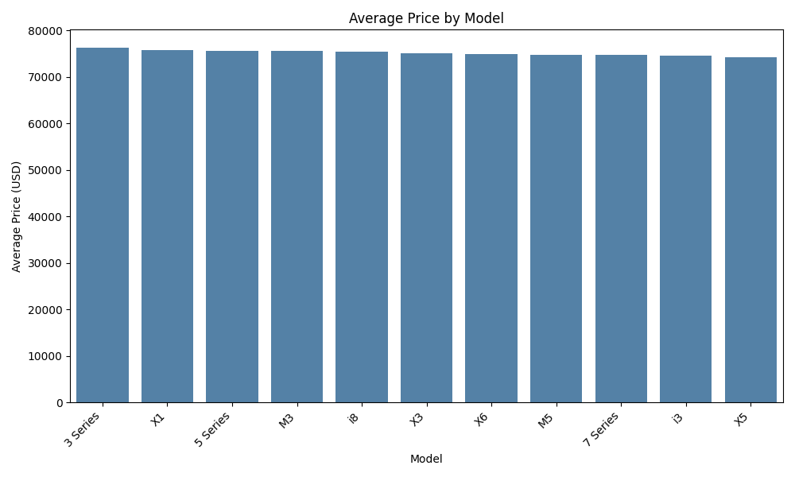

# BMW Global Sales Analysis Report (2020-2024)

> Generated by AI Multi-Agent System

## BMW Executive Report: Market Performance and Strategic Analysis

### Executive Summary

BMW's global sales performance from 2020 to 2024 has showcased both highs and lows, with sales peaking in 2022 at 17.92 million units and a slight downturn observed in 2023 with 16.27 million units. This report explores these fluctuations, delineating regional trends and identifying top-performing models and market segments. Furthermore, the analysis highlights the key drivers of sales, touching on pricing strategies, regulatory impacts, and potential growth opportunities. To strategically fortify BMW's market standing, insights are offered on maximizing revenue through untapped markets and revisiting pricing strategies.

---

### Detailed Analysis

#### Global Sales Trends

Between 2020 and 2024, BMW reported a total sales volume of 84.91 million units. Sales reached their pinnacle in 2022 with 17.92 million units, attributed likely to favorable economic conditions, product launches, or marketing strategies that year. Conversely, the lowest sales figure in this period was noted in 2023, with 16.27 million units sold, perhaps due to post-pandemic economic contractions or shifting consumer preferences.

The subsequent recovery in 2024 with 17.53 million units highlights potential stabilization or rebound through strategic adaptations. Year-over-year analysis indicates fluctuations in consumer demand or regional market conditions that BMW must continually navigate.

#### Performance by Region

When evaluating regional sales performance, Europe emerged as the leader with 14.57 million units, while South America lagged with 13.64 million units. The marginal differences among regions suggest variances primarily in local economic conditions, consumer preferences, and competitive markets. Europe's strong performance might be attributed to well-established brand loyalty and a robust network of dealers. In contrast, South America's lower performance, despite potential, may reflect economic instability or lower consumer purchasing power.

#### Price & Segment Drivers

Among the lineup, premium models such as the 3 Series ($76,305), X1 ($75,676), and 5 Series ($75,637) spearhead revenue, carrying high price points indicative of their market position. There is a clear correlation between these high-value products and their revenue-generating potential, asserting the importance of luxury and premium attributes in consumer value perception. The emphasis remains on effectively marketing these models to sustain high sales volumes that justify their price brackets.

#### Regulatory Context

In South America, evolving electrification policies and incentives are poised to significantly impact sales dynamics, particularly for electric and hybrid variants of the 5 Series. Government subsidies, favorable import duties, and urban policy developments bolster the economic appeal of electrified models. Such regulations preferentially fall upon models like the 2023 automatic electric and hybrid variants, whereas downturns in demand may affect the older, manual configurations unless countered by strategic pricing or incentives.

---

### Strategic Opportunities

1. **Exploring Emerging Markets:**
   Markets such as Africa and the Middle East promise untapped potential due to their growing economic landscapes. BMW should consider expanding its dealership networks in these territories and tailoring models to fit local demands.

2. **Pricing Strategy Adjustments:**
   Introducing price-sensitive models or financing options in underperforming regions like South America could elevate market penetration. Emphasizing flexible payment terms or trade-ins may attract customers wary of high upfront costs.

#### Conclusion

This comprehensive analysis underscores that BMW's sales performance is positively influenced by regional adaptability, strategic model positioning, and responsiveness to regulatory changes. While 2022 marked a high in sales, the dip in 2023 invites introspection and strategic recalibration. By addressing regional disparities, optimizing pricing tactics, and capitalizing on regulatory favorable trends, BMW can safeguard its market stronghold and harness opportunities for continued growth and market expansion.